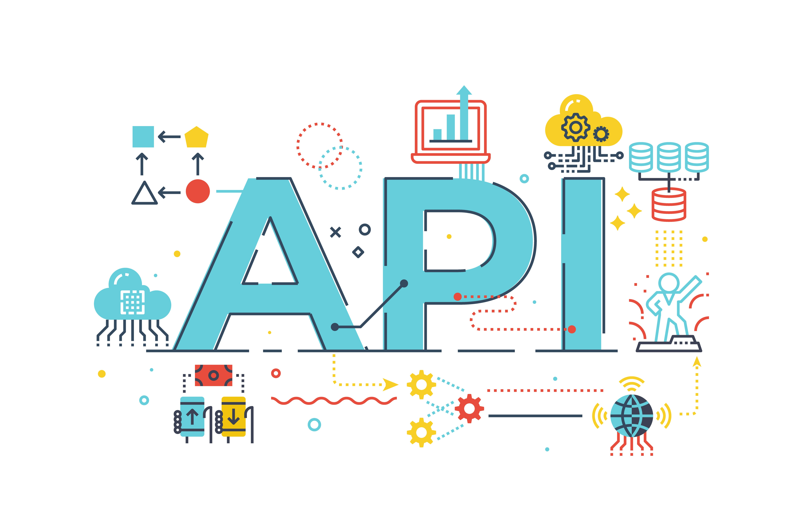

# Express API 🔌

<br />
<p align="center">
  <a href="https://github.com/jgome284/api-testing">
    
  </a>

  <h3 align="center">Foreword</h3>

  <p align="center">
    An express server with various api endpoints for testing 🧪💥🤓
    <br />
    <a href="https://github.com/jgome284/api-testing/issues">Report Bug</a>
    ·
    <a href="https://github.com/jgome284/api-testing/issues">Request Feature</a>
  </p>
</p>

## Table of Contents
- [Express API 🔌](#express-api-)
  - [Table of Contents](#table-of-contents)
  - [About](#about)
  - [Prerequisites](#prerequisites)
    - [Container Engine](#container-engine)
    - [Visual Studio Code](#visual-studio-code)
  - [Getting started](#getting-started)
  - [Testing](#testing)
  - [Endpoints](#endpoints)
    - [**/expressions**](#expressions)
      - [localhost:4000/expressions](#localhost4000expressions)
      - [localhost:4000/expressions/:id](#localhost4000expressionsid)
    - [**/hello**](#hello)
      - [localhost:4000/hello](#localhost4000hello)
    - [**/users**](#users)
      - [localhost:4000/users](#localhost4000users)
      - [localhost:4000/users/:id](#localhost4000usersid)

## About

This project provides a simple server to test and learn about API requests. Some tools to test the API include curl if you prefer testing via your command line interface or POSTMAN which simplifies requests via a GUI. Alternatively, if you like development on VS Code, thunderclient is another viable option which can be downloaded as an extension.

For reference, sample curl requests are provided in the Endpoints section below.

## Prerequisites

### Container Engine

The easiest way to get started is by leveraging the devcontainer in this repo. To do so, you will need a Container Engine like Docker installed and running. For Docker, the easiest way to start the container engine is via Docker Desktop.

### Visual Studio Code

The devcontainer provided is setup for use on Visual Studio Code. You should have it installed along with the [remote development pack](https://marketplace.visualstudio.com/items?itemName=ms-vscode-remote.vscode-remote-extensionpack) to enable the IDE's DevContainers functionality.

## Getting started

To start, open VS Code in a directory of your choice. With the terminal, clone this repository via `git clone https://github.com/jgome284/api-testing`.

Make sure you have your container engine running. On VS Code, open your local copy of the project and start the development container by running `Dev Containers: Rebuild and Reopen In Container` in the command palette. It can be accessed with the keyboard shortcut `ctrl + shift + P` on your keyboard.

When the Dev Container launches, install project dependencies via npm by executing the following command. 

```sh
npm install
```

If successful, a `node_modules` folder should appear in your directory. To start the server for testing run the following command.

```sh
npm start
```

Then, connect to the server on [localhost:4000](http://localhost:400) ... Make use of the endpoints listed below to practice making your own requests to the api.  Yay! (ﾉ◕ヮ◕)ﾉ*:･ﾟ🎊!

## Testing

To learn more about testing, reference [this article](https://www.taniarascia.com/making-api-requests-postman-curl/), which explains API testing via POSTMAN or curl.

Another great place to try API testing is [JSONPlaceholder.com](https://jsonplaceholder.typicode.com/). It is a free online REST API that you can use whenever you need some fake data. It can be in a README on GitHub, for a demo on CodeSandbox, in code examples on Stack Overflow, ...or simply to test things locally.

## Endpoints

This project's server is setup with 3 endpoints which are detailed below. To start the server run the following:
> node app.js

If successful, you should see a static site deployed at the root on `localhost:4000`.

**Note:** You can use curl -i to get more information from the headers.

### **/expressions**

#### localhost:4000/expressions

**GET** - get expressions
> curl localhost:4000/expressions

**POST** - add expression
> curl -X POST localhost:4000/expressions?name=pineapple&emoji=%F0%9F%8D%8D

#### localhost:4000/expressions/:id

**GET** - get expression from database by id
> curl localhost:4000/expressions/1

**PUT** - update expression from database by id
> curl -X PUT localhost:4000/expressions/1?name=cat&emoji=%F0%9F%98%BA

**DELETE** - delete expression from database by id
> curl -X DELETE localhost:4000/expressions/1

### **/hello**

#### localhost:4000/hello

**GET** - get static hello page
> curl localhost:4000/hello

**Note:** A 🍪 is set at this endpoint which provides a snapshot of the amount of page views made to this route. The session cookie is set to expires at 1 minute of inactivity. A new Set-Cookie header is added on every GET request to this endpoint to extend the session lifetime. Cool! 😎

### **/users**

#### localhost:4000/users

**GET** - get users
> curl localhost:4000/users

**POST** - add user
> curl -X POST -H "Content-Type: application/json" -d '{"user": {"username":"Joe Original", "password":"OriginalPassword1"}}' localhost:4000/users

#### localhost:4000/users/:id

**GET** - get user from database by id
> curl localhost:4000/users/1
